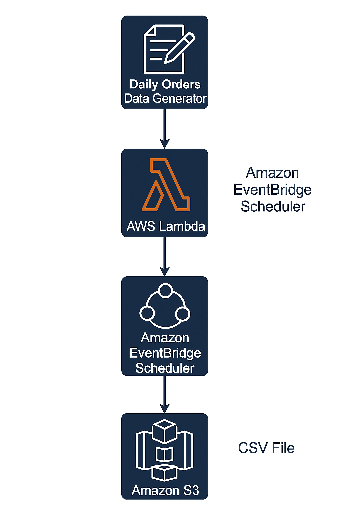

# Data Generation & Ingestion To S3 using AWS Lambda

This project generates fake e-commerce order data every day, closely mimicking real-world daily order data generation patterns. The data is saved as a CSV file and automatically uploaded to an S3 bucket using AWS Lambda and Amazon EventBridge Scheduler. This setup is ideal for testing data pipelines, analytics workflows, or simulating real-world order ingestion scenarios.

## ✍️ Features

* Generates 1000–2000 fake e-commerce orders per day using Faker.
* Saves the data as a CSV file in /tmp (Lambda’s temporary storage).
* Uploads the CSV file to Amazon S3 for permanent storage.
* Runs daily at a configurable time using Amazon EventBridge Scheduler.

## ⚙️ How It Works



1. Lambda Trigger
    * EventBridge Scheduler calls the Lambda function once per day.

2. CSV Generation
    * scripts/generate_data.py creates a pandas DataFrame with fake order data.
    * File is written to /tmp/orders_YYYY-MM-DD.csv (temporary storage in Lambda).

3. Upload to S3
    * File is uploaded to the S3 bucket defined in the environment variable: `BUCKET_NAME=my-s3-bucket-name`.

4. Persistence
    * Files in /tmp are temporary and may be deleted when Lambda shuts down.
    * Uploaded files in S3 are permanent.

## 🛠️ Setup & Deployment

1. Clone the repository

    ```bash
    git clone https://github.com/L00kAhead/auto_data_generation_and_ingestion.git
    cd auto_data_generation_and_ingestion
    ```

2. Deploy to AWS Lambda
    * Create a new Lambda function in AWS (Python 3.11 runtime).
    * Upload lambda_function.zip.
    * Set handler to: `lambda_function.lambda_handler`.

3. Configure environment variables
    * In AWS Console → Lambda → Configuration → Environment variables: `BUCKET_NAME = your-s3-bucket`

4. Assign IAM role

    * Attach a policy to your Lambda execution role allowing S3 upload:

        ```bash
        {
        "Effect": "Allow",
        "Action": "s3:PutObject",
        "Resource": "arn:aws:s3:::your-s3-bucket/*"
        }
        ```

5. Copy the code from scripts generate_data and lambda_function into you newly create AWS Lambda Function. (No external libs need).

6. Schedule with EventBridge
    * Go to Amazon EventBridge → Scheduler → Create Schedule.
    * Use this cron expression: `cron(30 16 * * ? *)`
        * Runs every day at 16:30 PM UTC.
    * Set Target = your Lambda function.

7. Test manually

    ```bash
    # Invoke the Lambda function directly
    aws lambda invoke \
        --function-name daily-orders-generator \
        --payload '{}' \
        response.json
    ```

## 🤝 Contributing

1. Fork the repository
2. Create a feature branch (git checkout -b feature/amazing-feature)
3. Commit your changes (git commit -m 'Add amazing feature')
4. Push to the branch (git push origin feature/amazing-feature)
5. Open a Pull Request

## License
MIT © 2025 Himanshu